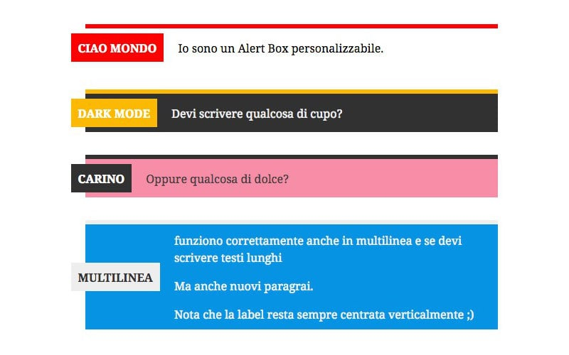

# SAM Gutenberg Blocks

This plugin is a WIP that aims to create a series of blocks to use inside [SkillsAndMore](https://skillsandmore.org), but if someone want's to use its codebase for it's own project fell free to do so!

We'll be happy to see you contributing in this project as well and we're going to document our experience inside our blog and a specific course!

## List of blocks
- [x] Alert Box
- [ ] Call to Action
- [ ] Pros & Cons
- [ ] Pricing Table
- [ ] Codepen
- [ ] Code Block
- [ ] Newsletter
- [ ] Accordion

## Block description

We'll be using this section to describe the blocks as soon as they will be released.

## Alert Box

The alert box is a useful element for any article. This kind of block lets you indicate a message where your reader has to keep more attention. The Alert Box block comes with the following settings:
* box background color
* text color
* label background color
* label color

For the moment i comes only with one style where we move the alert label to the left of the message but if you need more feel free to ask for them in the issue section.
